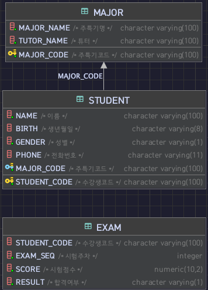
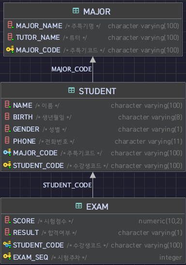

## MAJOR TABLE
``` sql
CREATE TABLE IF NOT EXISTS MAJOR
(
    major_code varchar(100) primary key comment '주특기코드',
    major_name varchar(100) not null comment '주특기명',
    tutor_name varchar(100) not null comment '튜터'
)
```

## STUDENT TABLE
``` sql
CREATE TABLE IF NOT EXISTS STUDENT
(
    student_code varchar(100) primary key comment '수강생코드',
    name varchar(100) not null comment '이름',
    birth varchar(8) null comment '생년월일',
    gender varchar(1) not null comment '성별',
    phone varchar(11) null comment '전화번호',
    major_code varchar(100) not null comment '주특기코드',
    foreign key (major_code) references MAJOR(major_code)
)
```

## EXAM TABLE
``` sql
CREATE TABLE IF NOT EXISTS EXAM
(
    student_code varchar(100) not null comment '수강생코드',
    exam_seq int not null comment '시험주차',
    score decimal(10, 2) not null comment '시험점수',
    result varchar(1) not null comment '합격여부'
);
```

## ERD_1


## ALTER
- EXAM 테이블 PK 복합설계 (데이터중복 막음)
- EXAM 테이블 FK 설계 (student_code)
``` sql
ALTER TABLE EXAM ADD PRIMARY KEY (student_code, exam_seq);

ALTER TABLE EXAM ADD CONSTRAINT exam_fk_student_code
    FOREIGN KEY (student_code) REFERENCES STUDENT (student_code);
```

## ERD_2


## INSERT
``` sql
INSERT INTO MAJOR VALUES('m1', '스프링', '말랑이');
INSERT INTO MAJOR VALUES('m2', '노드', '춘식이');
INSERT INTO MAJOR VALUES('m3', '플라스크', '쿼카');
INSERT INTO MAJOR VALUES('m4', '루비온레일즈', '루디');
INSERT INTO MAJOR VALUES('m5', '라라벨', '라이언');
INSERT INTO MAJOR VALUES('m6', '리엑트', '감자');
INSERT INTO MAJOR VALUES('m7', '뷰', '콘');
INSERT INTO MAJOR VALUES('m8', '엥귤러', '밍고');
```
``` sql
INSERT INTO STUDENT VALUES('s1', '가가가', '20220331', 'M', '01000000001', 'm1');
INSERT INTO STUDENT VALUES('s2', '나나나', '20220501', 'M', '01000000002', 'm1');
INSERT INTO STUDENT VALUES('s3', '다다다', '20220711', 'M', '01000000003', 'm1');
INSERT INTO STUDENT VALUES('s4', '라라라', '20220408', 'M', '01000000004', 'm6');
INSERT INTO STUDENT VALUES('s5', '마마마', '20220921', 'F', '01000000005', 'm6');
INSERT INTO STUDENT VALUES('s6', '바바바', '20221111', 'M', '01000000006', 'm7');
INSERT INTO STUDENT VALUES('s7', '사사사', '20221117', 'F', '01000000007', 'm8');
INSERT INTO STUDENT VALUES('s8', '아아아', '20220623', 'F', '01000000008', 'm6');
INSERT INTO STUDENT VALUES('s9', '자자자', '20220511', 'M', '01000000009', 'm2');
INSERT INTO STUDENT VALUES('s10', '차차차', '20220504', 'F', '01000000010', 'm8');
INSERT INTO STUDENT VALUES('s11', '카카카', '20220222', 'M', '01000000020', 'm2');
INSERT INTO STUDENT(student_code, name, gender, major_code) VALUES('s12', '타타타', 'M', 'm3');
INSERT INTO STUDENT VALUES('s13', '파파파', '20220121', 'F', '01000000030', 'm1');
INSERT INTO STUDENT(student_code, name, gender, major_code) VALUES('s14', '하하하', 'M', 'm4');
INSERT INTO STUDENT VALUES('s15', '기기기', '20221101', 'F', '01000000040', 'm1');
INSERT INTO STUDENT(student_code, name, birth, gender, phone, major_code) VALUES('s16', '니니니', '20221105', 'M', '01000000050', 'm5');
INSERT INTO STUDENT(student_code, name, gender, major_code) VALUES('s17', '디디디', 'F', 'm7');
INSERT INTO STUDENT(student_code, name, birth, gender, phone, major_code) VALUES('s18', '리리리', '20220508', 'M', '01000000060', 'm6');
INSERT INTO STUDENT VALUES('s19', '미미미', '20220505', 'F', '01000000070', 'm2');
INSERT INTO STUDENT VALUES('s20', '비비비', '20220909', 'M', '01000000080', 'm3');
INSERT INTO STUDENT VALUES('s21', '시시시', '20220303', 'F', '01000000090', 'm6');
```
``` sql
INSERT INTO EXAM VALUES('s1', 1, 8.5, 'P');
INSERT INTO EXAM VALUES('s1', 2, 9.5, 'P');
INSERT INTO EXAM VALUES('s1', 3, 3.5, 'F');
INSERT INTO EXAM VALUES('s2', 1, 8.2, 'P');
INSERT INTO EXAM VALUES('s2', 2, 9.5, 'P');
INSERT INTO EXAM VALUES('s2', 3, 7.5, 'P');
INSERT INTO EXAM VALUES('s3', 1, 9.3, 'P');
INSERT INTO EXAM VALUES('s3', 2, 5.3, 'F');
INSERT INTO EXAM VALUES('s3', 3, 9.9, 'P');
INSERT INTO EXAM VALUES('s4', 1, 8.4, 'P');
INSERT INTO EXAM VALUES('s5', 1, 9.5, 'P');
INSERT INTO EXAM VALUES('s5', 2, 3.5, 'F');
INSERT INTO EXAM VALUES('s6', 1, 8.3, 'P');
INSERT INTO EXAM VALUES('s7', 1, 9.2, 'P');
INSERT INTO EXAM VALUES('s7', 2, 9.9, 'P');
INSERT INTO EXAM VALUES('s7', 3, 3.6, 'F');
INSERT INTO EXAM VALUES('s8', 1, 8.4, 'P');
INSERT INTO EXAM VALUES('s9', 1, 9.7, 'P');
INSERT INTO EXAM VALUES('s10', 1, 8.4, 'P');
INSERT INTO EXAM VALUES('s10', 2, 9.8, 'P');
INSERT INTO EXAM VALUES('s10', 3, 8.4, 'P');
INSERT INTO EXAM VALUES('s11', 1, 8.6, 'P');
INSERT INTO EXAM VALUES('s12', 1, 9.2, 'P');
INSERT INTO EXAM VALUES('s13', 1, 8.1, 'P');
INSERT INTO EXAM VALUES('s13', 2, 9.5, 'P');
INSERT INTO EXAM VALUES('s13', 3, 2.1, 'F');
INSERT INTO EXAM VALUES('s14', 1, 9.2, 'P');
INSERT INTO EXAM VALUES('s15', 1, 9.7, 'P');
INSERT INTO EXAM VALUES('s15', 2, 1.7, 'F');
INSERT INTO EXAM VALUES('s16', 1, 8.4, 'P');
INSERT INTO EXAM VALUES('s17', 1, 9.3, 'P');
INSERT INTO EXAM VALUES('s17', 2, 9.9, 'P');
INSERT INTO EXAM VALUES('s17', 3, 1.3, 'F');
INSERT INTO EXAM VALUES('s18', 1, 9.9, 'P');
INSERT INTO EXAM VALUES('s19', 1, 9.4, 'P');
INSERT INTO EXAM VALUES('s19', 2, 8.9, 'P');
INSERT INTO EXAM VALUES('s19', 3, 7.4, 'F');
INSERT INTO EXAM VALUES('s20', 1, 8.1, 'P');
INSERT INTO EXAM VALUES('s20', 2, 6.4, 'F');
INSERT INTO EXAM VALUES('s21', 1, 9.5, 'P');
INSERT INTO EXAM VALUES('s21', 2, 8.8, 'P');
INSERT INTO EXAM VALUES('s21', 3, 8.2, 'P');
```

## UPDATE
``` sql
INSERT INTO STUDENT VALUES('s0', '수강생', '20220331', 'M', '01000000005', 'm1');
UPDATE STUDENT SET major_code= 'm2' where student_code= 's0';
```

## DELETE
``` sql
DELETE FROM STUDENT WHERE student_code = 's0';
```

## SELECT
``` sql
SELECT * FROM STUDENT;
SELECT * FROM STUDENT WHERE student_code = 's1';
SELECT name, major_code FROM STUDENT WHERE student_code = 's1';
```

## JOIN
``` sql
SELECT s.name, s.major_code, m.major_name
FROM STUDENT s JOIN MAJOR m ON s.major_code = m.major_code;
```