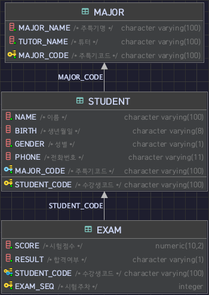

## MAJOR TABLE
``` sql
CREATE TABLE IF NOT EXISTS MAJOR
(
    major_code varchar(100) primary key comment '주특기코드',
    major_name varchar(100) not null comment '주특기명',
    tutor_name varchar(100) not null comment '튜터'
)
```

## STUDENT TABLE
``` sql
CREATE TABLE IF NOT EXISTS STUDENT
(
    student_code varchar(100) primary key comment '수강생코드',
    name varchar(100) not null comment '이름',
    birth varchar(8) null comment '생년월일',
    gender varchar(1) not null comment '성별',
    phone varchar(11) null comment '전화번호',
    major_code varchar(100) not null comment '주특기코드',
    foreign key (major_code) references MAJOR(major_code)
)
```

## EXAM TABLE
``` sql
CREATE TABLE IF NOT EXISTS EXAM
(
    student_code varchar(100) not null comment '수강생코드',
    exam_seq int not null comment '시험주차',
    score decimal(10, 2) not null comment '시험점수',
    result varchar(1) not null comment '합격여부'
);
```

## ERD_1


## ALTER
- EXAM 테이블 PK 복합설계 (데이터중복 막음)
- EXAM 테이블 FK 설계 (student_code)
``` sql
ALTER TABLE EXAM ADD PRIMARY KEY (student_code, exam_seq);

ALTER TABLE EXAM ADD CONSTRAINT exam_fk_student_code
    FOREIGN KEY (student_code) REFERENCES STUDENT (student_code);
```

## ERD_2


## INSERT
``` sql
INSERT INTO MAJOR VALUES('m1', '스프링', '말랑이');
INSERT INTO MAJOR VALUES('m2', '노드', '춘식이');
INSERT INTO MAJOR VALUES('m3', '플라스크', '쿼카');
INSERT INTO MAJOR VALUES('m4', '루비온레일즈', '루디');
INSERT INTO MAJOR VALUES('m5', '라라벨', '라이언');
INSERT INTO MAJOR VALUES('m6', '리엑트', '감자');
INSERT INTO MAJOR VALUES('m7', '뷰', '콘');
INSERT INTO MAJOR VALUES('m8', '엥귤러', '밍고');
```