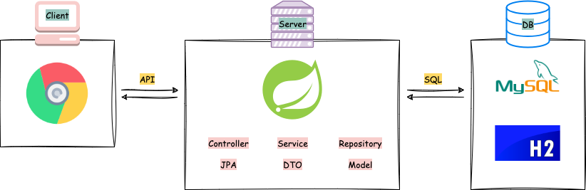
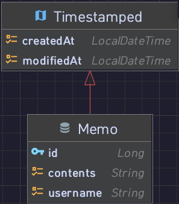

📍 [GitHub 바로가기](https://velog.io/@mallang/SpringBoot-CRUDprojectMallangMEMO)

## 🔗 Service Architecture

## 💡 ERD

## 🔐 Project API
|기능|Method|URL| Return       |
|---|:---:|---|--------------|
|메인페이지|GET|/| index.html   |
|메모 생성|POST|/api/memos| Memo         |
|메모 조회|GET|/api/memos| List\<Memo\> |
|메모 변경|PUT|/api/memos/{id}| Long         |
|메모 삭제|DELETE|/api/memos/{id}| Long         |

## ⚙️ Project Setting
- 아티팩트 : mallangMEMO
- JDK : openjdk-19
- Java : 17
- 패키지생성 : Jar
- Springboot : 3.1.2