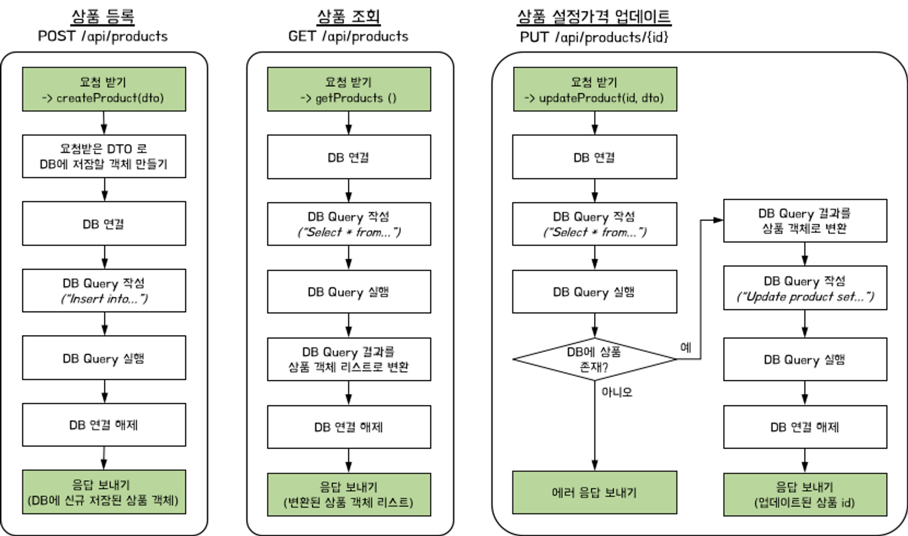
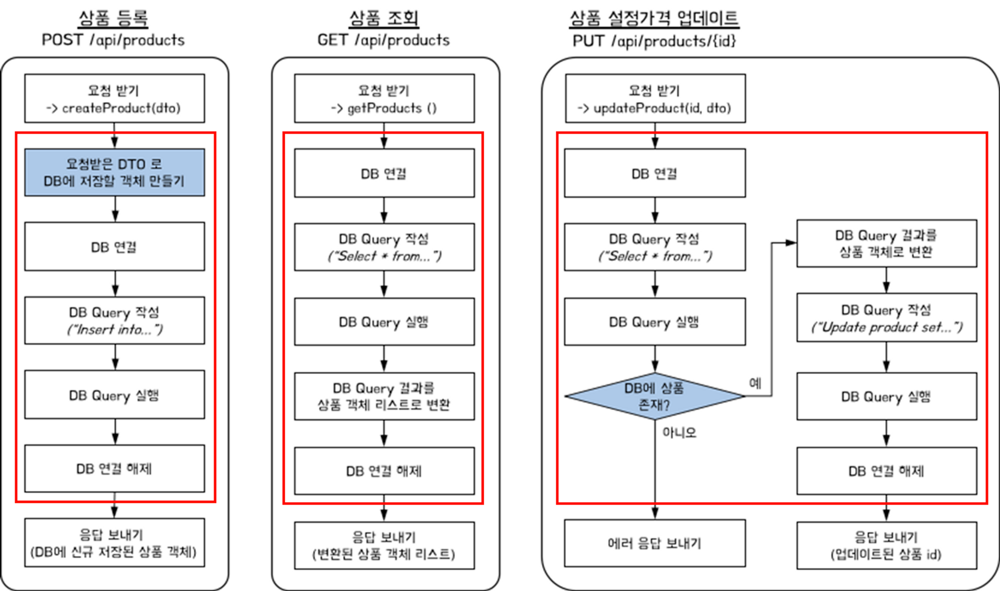
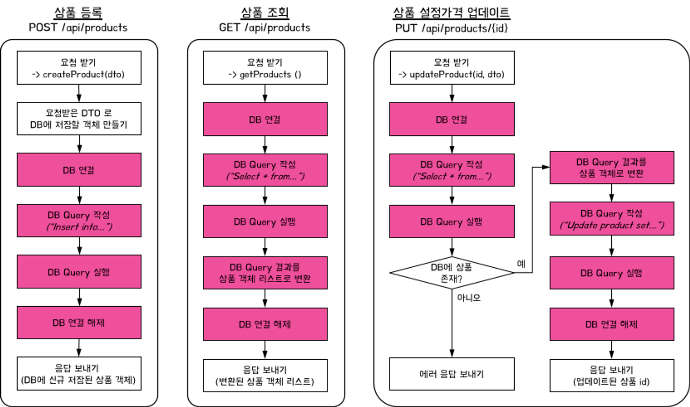

# 🐰 mallangShop

[📍 Velog 바로가기](https://velog.io/@mallang/SpringBoot-mallangShop)

## 1 mallangShop 베타버전 Refactoring 

### 1️⃣ 서비스기능
|서비스기능|
|---|
|1. 키워드로 상품검색 → 결과 목록으로 보여주기|
|2. 관심상품 등록하기|
|3. 관심상품 조회하기|
|4. 관심상품 최저가등록하기|

### 2️⃣ API 명세서 - Product
|기능|Method|URL|Request| Response                                                                                                                                                                                                                                |
|---|---|---|---|-----------------------------------------------------------------------------------------------------------------------------------------------------------------------------------------------------------------------------------------|
|메인페이지|`GET`|/api/shop|-| index.html                                                                                                                                                                                                                              |
|Query로 상품검색, 상품검색결과 목록반환|`GET`|/api/search?query=검색어|-| [   {   &nbsp;&nbsp;"title" : String,   &nbsp;&nbsp;"image" : String,   &nbsp;&nbsp;"link" : String,   &nbsp;&nbsp;"lprice" : int   },   •••   ]                                                                |
|관심상품 등록|`POST`|/api/products|{   &nbsp;&nbsp;"title" : String,   &nbsp;&nbsp;"image" : String,   &nbsp;&nbsp;"link" : String,   &nbsp;&nbsp;"lprice" : int   }| {   &nbsp;&nbsp;"id" : Long,   &nbsp;&nbsp;"title" : String,   &nbsp;&nbsp;"image" : String,   &nbsp;&nbsp;"link" : String,   &nbsp;&nbsp;"lprice" : int,   &nbsp;&nbsp;"myprice" : int   }                        |
|관심상품 조회|`GET`|/api/products|-| [   {   &nbsp;&nbsp;"id" : Long,   &nbsp;&nbsp;"title" : String,   &nbsp;&nbsp;"image" : String,   &nbsp;&nbsp;"link" : String,   &nbsp;&nbsp;"lprice" : int,   &nbsp;&nbsp;"myprice" : int   },   •••  ] |
|관심상품 최저가 등록|`PUT`|/api/products/{id}|{   &nbsp;&nbsp;"myprice" : int   }|id|

### 3️⃣ AllInOneController 역할분리
#### 📍 Controller

#### 📍 Service

#### 📍 Repository

## 2 mallangShop 인증 Feature

### 1️⃣ 서비스기능 추가
|서비스기능|
|---|
|5. 회원가입|
|6. 로그인&로그아웃|

### 2️⃣ API 명세서 - User
|기능|Method|URL|Request|Response|
|---|---|---|---|---|
|회원가입페이지|`GET`|/api/user/signup|-|signup.html|
|회원가입|`POST`|/api/user/signup|POST Form 태그   {   &nbsp;&nbsp;"username" : String,   &nbsp;&nbsp;"password" : String,   &nbsp;&nbsp;"email" : String,   &nbsp;&nbsp;"admin" : boolean,   &nbsp;&nbsp;"adminToken" : String   }|redirect:/api/user/login|
|로그인페이지|`GET`|/api/user/login|-|login.html|
|로그인|`POST`|/api/user/login|POST Form 태그   {   &nbsp;&nbsp;"username" : String,   &nbsp;&nbsp;"password" : String   }|redirect:/api/shop|

### 3️⃣ 한계점
- 회원가입, 로그인 기능은 정상적으로 작동하나, 정보가 유지되지 않음
- 회원별로 다른 상품을 보여줄 수 없음
- `adminToken` → 계속된 전송으로 노출이 쉬워, 보안 취약

## 3 mallangShop 인가 Feature

### 1️⃣ 서비스기능 수정 및 추가
|서비스기능|
|---|
|5. 회원가입|
|6. 로그인|
|7. 로그인성공 → Token 발급|
|8. 로그아웃|
|9. 로그인 한 회원 → 관심상품 등록/조회/최저가등록 가능|
|10. ADMIN계정 → 모든상품 조회가능|

### 2️⃣ API 명세서 수정 - User
| 기능      |Method| URL |Request| Response                                                    |
|---------|---|---|---|-------------------------------------------------------------|
| 회원가입페이지 |`GET`| /api/user/signup |-| signup.html                                                 |
| 회원가입    |`POST`| /api/user/signup |POST Form 태그   {   &nbsp;&nbsp;"username" : String,   &nbsp;&nbsp;"password" : String,   &nbsp;&nbsp;"email" : String,   &nbsp;&nbsp;"admin" : boolean,   &nbsp;&nbsp;"adminToken" : String   }| redirect:/api/user/login                                    |
| 로그인페이지  |`GET`| /api/user/login |-| login.html                                                  |
| 로그인     |`POST`| /api/user/login|{   &nbsp;&nbsp;"username" : String,   &nbsp;&nbsp;"password" : String   } | Header   Authorization : Bearer \<JWT>     success |

## 4 mallangShop 최종 Feature

### 1️⃣서비스기능
|서비스기능|
|---|
|1. 키워드로 상품검색  → 결과 목록으로 보여주기|
|2. 회원가입|
|3. 로그인|
|4. 로그인성공  → Token 발급|
|5. 로그아웃|
|6. 로그인 한 회원 → 관심상품 등록/조회/최저가등록 가능|
|7. ADMIN계정 → 모든상품 조회가능|
|8. 관심상품 목록 페이징 및 정렬|
|9. 폴더 생성 및 조회|
|10. 관심상품 → 폴더추가|
|11. 폴더 별 관심상품 조회|