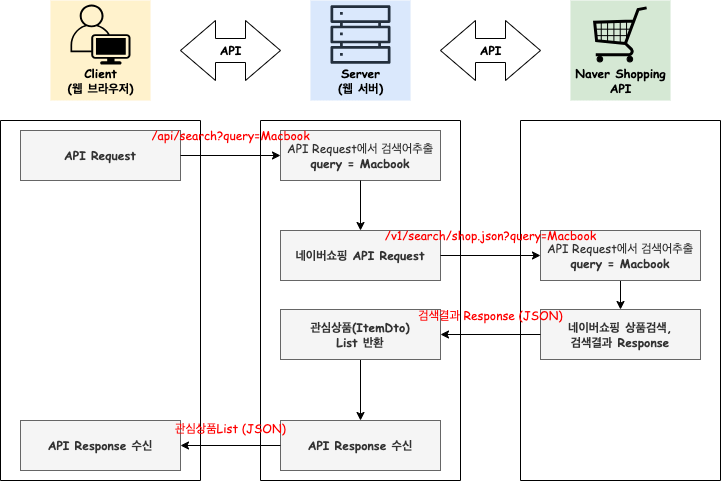

# mallangShopBeta

[📍 Velog 바로가기]()

### 1️⃣ 서비스기능
|서비스기능|
|---|
|1. 키워드로 상품검색 → 결과 목록으로 보여주기|
|2. 관심상품 등록하기|
|3. 관심상품 조회하기|
|4. 관심상품 최저가등록하기|

### 2️⃣ API 동작순서 Architecture

### 3️⃣ API 명세서
|기능|Method|URL|Request| Response                                                                                                                                                                                                                                |
|---|---|---|---|-----------------------------------------------------------------------------------------------------------------------------------------------------------------------------------------------------------------------------------------|
|메인페이지|`GET`|/api/shop|-| index.html                                                                                                                                                                                                                              |
|Query로 상품검색, 상품검색결과 목록반환|`GET`|/api/search?query=검색어|-| [   {   &nbsp;&nbsp;"title" : String,   &nbsp;&nbsp;"image" : String,   &nbsp;&nbsp;"link" : String,   &nbsp;&nbsp;"lprice" : int   },   •••   ]                                                                |
|관심상품 등록|`POST`|/api/products|{   &nbsp;&nbsp;"title" : String,   &nbsp;&nbsp;"image" : String,   &nbsp;&nbsp;"link" : String,   &nbsp;&nbsp;"lprice" : int   }| {   &nbsp;&nbsp;"id" : Long,   &nbsp;&nbsp;"title" : String,   &nbsp;&nbsp;"image" : String,   &nbsp;&nbsp;"link" : String,   &nbsp;&nbsp;"lprice" : int,   &nbsp;&nbsp;"myprice" : int   }                        |
|관심상품 조회|`GET`|/api/products|-| [   {   &nbsp;&nbsp;"id" : Long,   &nbsp;&nbsp;"title" : String,   &nbsp;&nbsp;"image" : String,   &nbsp;&nbsp;"link" : String,   &nbsp;&nbsp;"lprice" : int,   &nbsp;&nbsp;"myprice" : int   },   •••  ] |
|관심상품 최저가 등록|`PUT`|/api/products/{id}|{   &nbsp;&nbsp;"myprice" : int   }|id|

### 4️⃣ Project Setting
- 언어 : JAVA
- 타입 : Gradle-Groovy
- 패키지 : Jar
- JDK : openjdk-19
- Java : 17
- SpringBoot : 3.1.2g